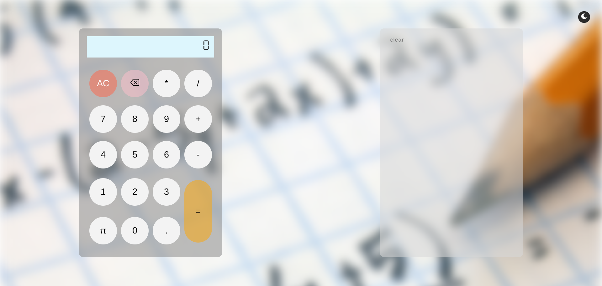
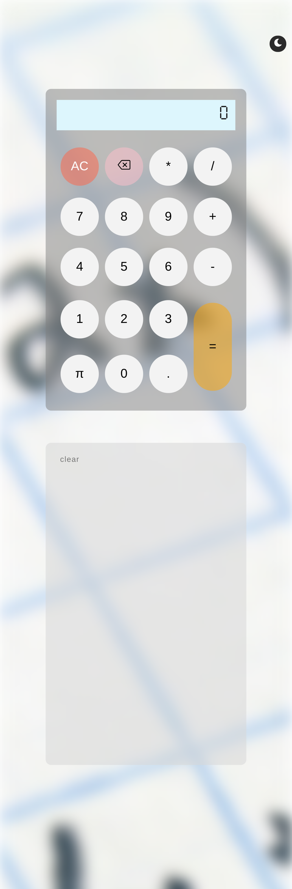
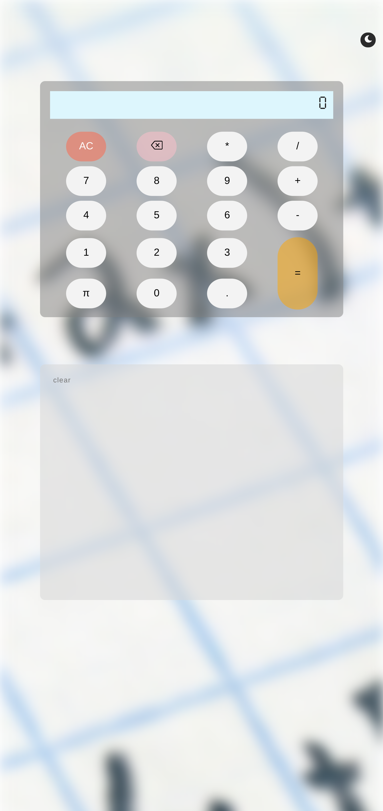
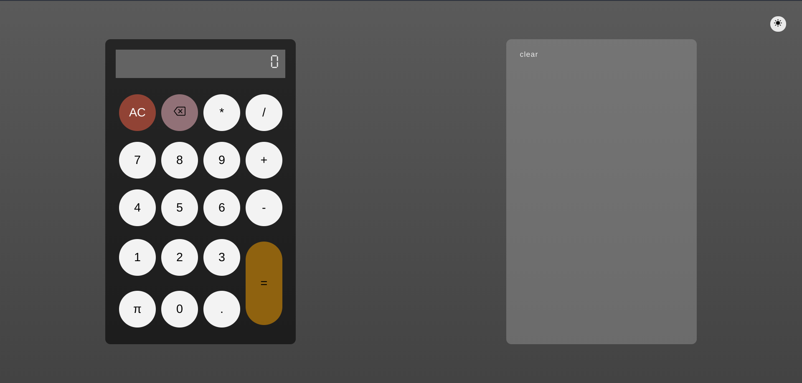

# Basic Calculus

---

[**Basic Calculus**](https://basic-calculus-0.web.app/) is a simple calculator that can do a great job in simple math: addition, subtraction, multiplication and division. It has some cool features.

Link : <https://basic-calculus-0.web.app/>

## Features

This calculator has few features that make it unique and sweetable.

### Nice UI design

This calculator has a sophisticated design that matches the spirit of the times.

### Respensive design

Calculus has respensive design for tree types of screens.

#### For computers

The picture is above ⬆️

#### For smartphones

#### For tablets

### Night mode

This is the coolest feature of this calculator.

### Calculation history card

when you do some math with Basic Calculus, it automatically save the results in card . This functionality helps you to compare analyse and copy the results.

